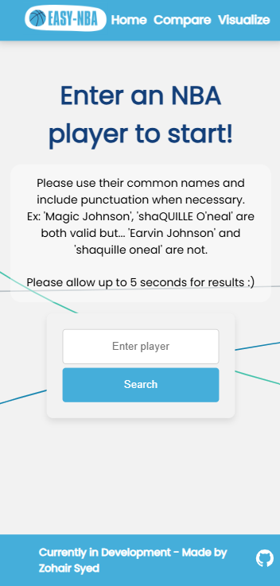
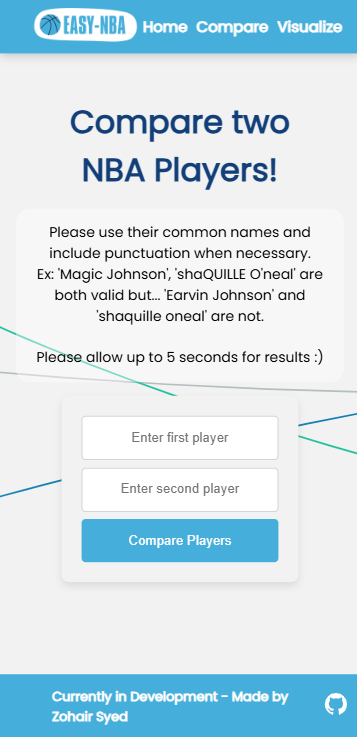
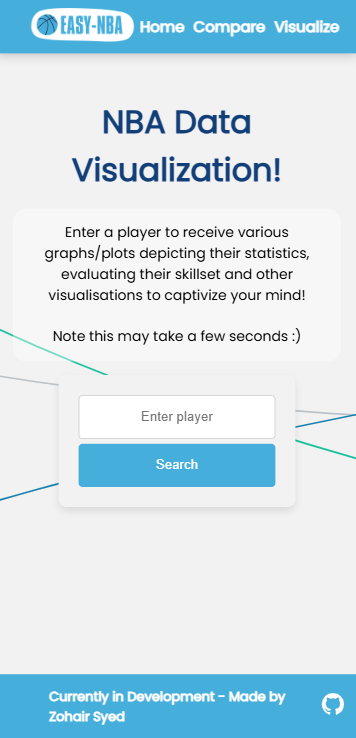
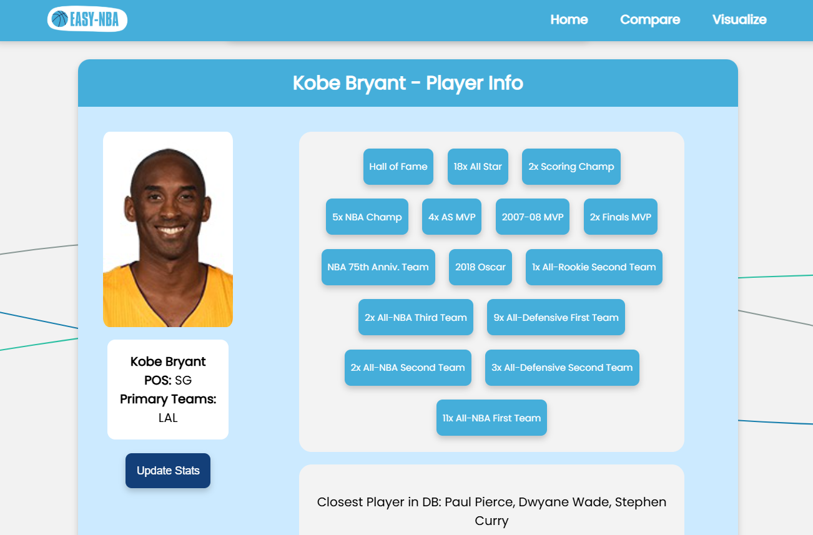
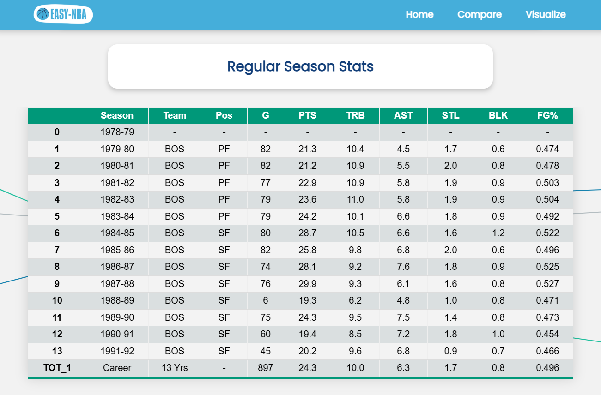
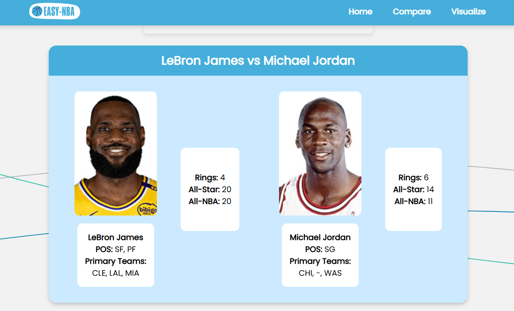
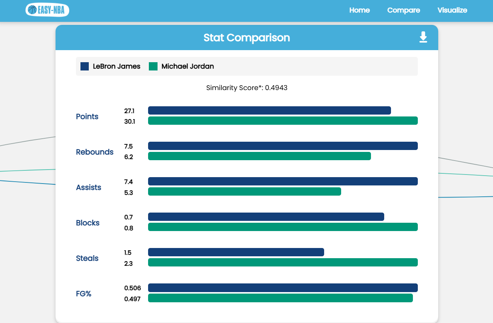
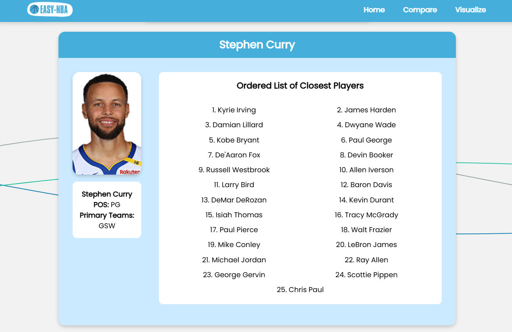
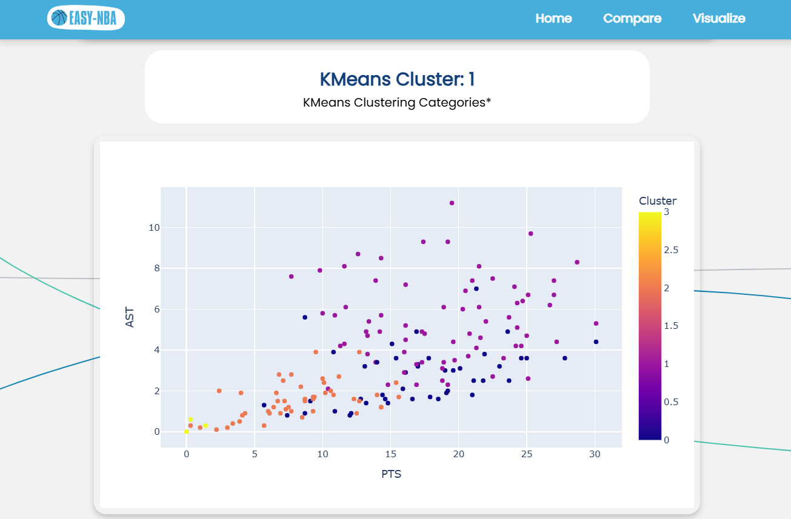

# Easy-NBA

**Easy-NBA** is a Flask-based web application designed to be the all-in one experience for NBA statistical data. It uses a combination of web scraping, database management, and machine learning to provide an immersive experience in visualizing, comparing, analyzing, and predicting career statistical data. Visit [easy-nba.onrender.com](https://easy-nba.onrender.com/visualize) to take a look or read below for the full features!

## Features and Images

Easy-NBA features three main pages: home, compare and visualize!

<p align="center">
  
  


</p>

Use these pages to view your favourite players' statistics, compare NBA players head-to-head, and visualize plots about the all-time greats!


<p align="center">
  
  
  
  
  
  
</p>

## Deployment/Installation

**NEW!** Easy-NBA is finally available online through Render!

Visit [easy-nba.onrender.com](https://easy-nba.onrender.com/visualize) to get the full experience!
Note: currently the Render server may be offline, so please await future improvements

**Optional: Clone through Git**
Currently, the DB is not situated for offline use, but the .sql file will be available soon.
To clone the repository you can start `run.py` after cloning via:

```
git clone https://github.com/zsspan/Easy-NBA
```

## Technologies Used

- **Backend/Frontend**: Python Flask, JavaScript, HTML/CSS
- **Data Handling/Visualization**: Jupyter, Pandas, BeautifulSoup, Seaborn, Plotly
- **Database**: MySQL, SQLite
- **Machine Learning**: Scikit-learn

**Easy-NBA** uses initial web requests to query for any new NBA player data and subsequently stores the data in a MySQL database for quick DB access and operations. With this large custom dataset, users are able to compare players, generate player overviews, list achievements, rank player similarity using machine learning, and a whole lot more.

## Data

The main data used for some calculations is a large 'master-table' containing rows of career data among many players. With the helper file in the utils directory, players can continue to scrape for players and add to the dataset. This dataset is currently updated in the MySQL version of the app, but users can access the (soon-to-be-updated) SQLite version for a local experience.
